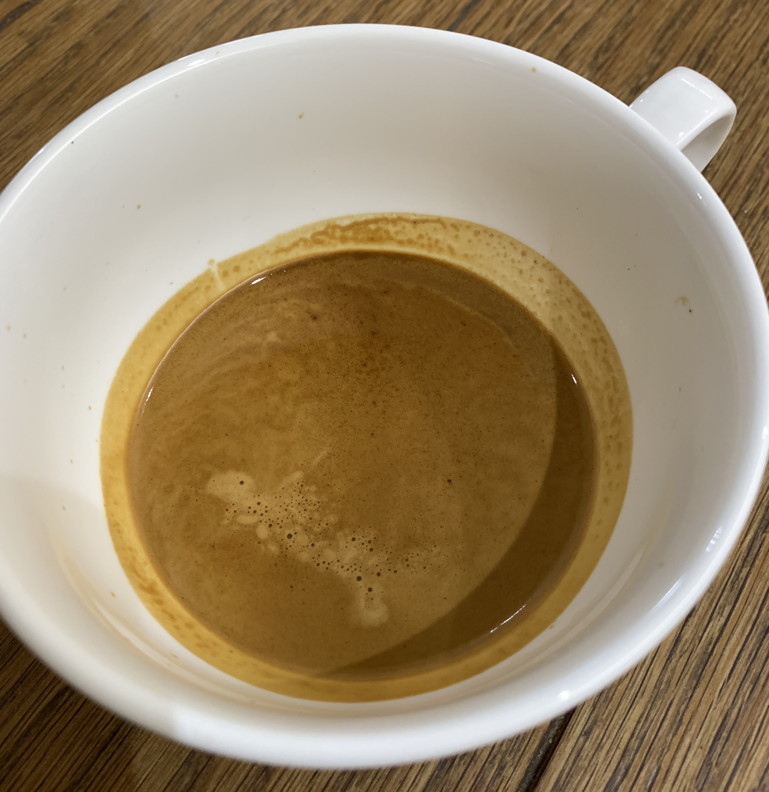

 # A beginner's guide to the Sage/Breville Barista Express
 
I've always leaned towards the small independent coffee shops rather than the larger chains, appreciating that some coffee is better than others, but never really understanding why. I've heard people talking about the various flavours they could taste in espresso, but I've always thought that "coffee just tasted like coffee". A small coffee shop in Perth, Australia opened my eyes a few years ago by serving the most amazing espresso I'd ever tasted. It was a single origin and, for the first, it didn't just taste of coffee. It was fruity! 

I purchased a Sage/Breville Barista Express ~8 weeks ago, as a replacement for a Nespresso machine. The Nespresso machine is very convenient, but I wanted something better, especially as I primarily drink latte. My initial results with the Barista Express were good, but very inconsistent. This is a short guide to my experiences using the Barista Express, and how I achieve good consistent results with the single-wall (non-pressurised) double-shot basket.

This guide should also help to answer the typical question I see on [Reddit](https://www.reddit.com/r/espresso/) too:

> I've just bought a Barista Express, my shots are too fast even though I'm at the finest grinder setting and/or have changed the internal burr ... what am I doing wrong?

As you'll see shortly, this was exactly my first experience too. If you don't want to read on, the basic answer is (1) distribute your ground coffee evenly in the basket, and (2) tamp flat and *hard*. Also, and counterintuively, be prepared to make the grind size *coarser* to fix fast shots.

## Table of contents

- [First steps and inconsistent results](#first-steps-and-inconsistent-results)
- [Check the water level](#check-the-water-level)
- [Warm the machine](#warm-the-machine)
- [Brewing temperature](#brewing-temperature)
- [Dose](#dose)
- [Grind size](#grind-size)
- [Single dosing vs filling the hopper](#single-dosing-vs-filling-the-hopper)
- [Grinder retention](#grinder-retention)
- [Fluffing the ground coffee](#fluffing-the-ground-coffee)
- [Clean and dry the portafilter](#clean-and-dry-the-portafilter)
- [Transfer the ground coffee](#transfer-the-ground-coffee)
- [Tamping pressure (and the Razor tool)](#tamping-pressure-and-the-razor-tool)
- [Quick flush and wipe](#quick-flush-and-wipe)
- [Measuring time - button press or first drop of espresso?](#measuring-time---button-press-or-first-drop-of-espresso)
- [Stopping the shot](#stopping-the-shot)
- [Pressure gauge](#pressure-gauge)
- [Shot too fast](#shot-too-fast)
- [Shot too slow](#shot-too-slow)
- [Brew ratio and taste](#brew-ratio-and-taste)
- [Minimising waste](#minimising-waste)
- [Storing beans](#storing-beans)
- [Steaming milk and latte art](#steaming-milk-and-latte-art)
- [Hot chocolate](#hot-chocolate)

## tl;dr

- Check the water level.
- Warm up the machine for at least 10-15 minutes.
- Weigh and single-dose 17-19g of beans into the grinder.
- Grind into a small cup.
- Weigh the ground coffee (add or remove to match your desired dose).
- Gently shake/stir the ground coffee to get it "fluffy" and remove any large clumps.
- Clean and dry the portafilter basket.
- Tip the ground coffee into the portafilter, and level/smooth with a finger, making sure to fill any gaps, especially around the basket edge.
- Tamp hard (and/or use a distribution tool).
- Quickly flush with the single shot button (just a few seconds), ideally with a cup underneath to pre-heat it.
- Insert the portafilter and start the shot (a shot time of 25-35 seconds, from pressing the button, is a good starting point).
- For best results, weigh the output rather than relying on the default shot button timings (a 1:2 ratio is a good starting point; e.g. 18g of coffee in, 36g of espresso out).
- Don't worry about too much about the pressure gauge.
- Keep your beans fresh by storing them properly (away from moisture, with as little air as possible).

## First steps and inconsistent results

By the time the machine arrived in the mail, I'd already watched a bunch of YouTube videos about dose, yield, grind size, timing, sour vs bitter, etc. I'd bought a bag of fresh, medium roasted, fruity, single origin beans, and was ready to dial them in. I thought I was prepared, but I was wrong.

After filling the hopper with beans, I set the grind size somewhere in the middle ("8"), ground 18g of beans into the portafilter, levelled the coffee, tamped, and brewed a shot. The initial shots ran fast (<15 seconds), smelt sour, and definitely tasted sour. Plus the pressure gauge was only just inside the "espresso zone". I knew that "sour" meant underextracted, and I wasn't getting enough pressure on the gauge, so I made the grind size finer, and tried again. Same result. Time to grind finer, and try again. Same result. I repeated this a few times, and eventually got down to a grind setting of "1", without any real change.

I did some research, and saw you could change the internal burr setting, to make the grind even finer. I switched this from "6" to "5", reset the outer grind setting to the middle again ("7"), and repeated the process until I managed to choke the machine. After this, I set the grind size one step coarser and left it at that. The resulting espresso was now pouring in the desired 25-35 second range, but still smelled and tasted sour. The tasting notes said, "tangy berries". I wasn't getting that, but I'd not tasted the coffee prepared using this bean, so I thought that was perhaps just how it was supposed to be. It wasn't unpleasant, and I did get some good lattes.

I'd read that light-medium roasted beans are harder to dial in, so I switched beans, with the next bag being a darker roast. These beans were a bit easier to dial in. The grind setting was coarser, the espresso flow looked more consistent, and I could definitely taste the chocolate flavour mentioned in the tasting notes. But the darker roast was a bit too much for me, so I went back to something medium roasted and fruity for the next bag. Dialling in beans was certainly getting easier, and I was now sometimes able to recognise some of the mentioned tasting notes. But everything was just so inconsistent. Some shots would gush, and some would choke. Some espressos would be rich with crema, with others being watery and thin. Some pours started out slow and steady, but then they'd switch to a gushing watery stream half way through. Trying to stop the yield at a specific weight was often hopeless. If I was aiming for a 36g yield, I'd try to stop the machine at 32g, to account for the drips that happen after shutting off the machine. Sometimes that would work, and sometimes I'd get 10-15g of liquid gush through the portafilter into the cup below (even after stopping the machine), completely missing my target.

I did some research on possible causes, which led me to "channeling", where the high pressure forces water through weak spots in the coffee puck. So I tried a few things to better distribute the coffee, including [WDT](https://www.home-barista.com/weiss-distribution-technique.html). This didn't help, which surprised me. I then decided to get a palm tamper/distribution tool, in a bid to improve the consistency. This didn't help either - initially anyway, but more on that later.

At this point I was getting some great tasting coffee (especially with milk), but it was hugely inconsistent. I knew that I was doing something wrong, but I couldn't figure out what it was. So I bought a bag of supermarket espresso blend beans (because they were cheaper) to experiment with. A dozen shots later (don't worry, I wasn't drinking it!), I'd managed to start pulling consistent smooth flowing shots. I'd finally stumbled upon what I was doing wrong - distribution and tamping.

So let's step back, what steps are required to get consistent espresso shots?

## Check the water level

This sounds obvious until you forget, and run out of water half way through a shot. This has happened to me, more than once! 🙄

## Warm the machine

It's tempting to skip this step, especially early in the morning, but do wait at least 10-15 minutes to ensure everything is warmed up (including the portafilter, and basket). A warm machine does resolve some of the sourness and consistency problems. If you're in a hurry, push 2-3 single shots through an empty portafilter (no coffee; just the basket) to speed up the process.

## Brewing temperature

The brewing temperature can also make a difference. A higher temperature can help tame sourness, and a lower temperature can help tame bitterness. Whenever I get a new bean, I will adjust the brewing temperature as follows:

 - Light-medium roast: +1/+2C
 - Medium roast: +0C (default)
 - Medium-dark roast:  -1/-2C

If in doubt, just use the default temperature and only adjust the temperature if you're having issues with a sourness or bitterness that remains after what looks a perfect shot. See the instruction guide for details of how to change the brewing temperature.

## Dose

I initially started with the single-wall single-shot basket because I thought I'd use fewer beans this way, but it turns out the single shot basket is _notoriously_ difficult to work with. So I switched it out for the single-wall double-shot basket.

Every coffee is different, but I find that 18g (+/- 1g) is a good starting point for the Barista Express, in the standard single-wall double-shot basket. Whatever dose you choose, be consistent, and be precise. +/-0.5g dose difference between shots _can_ and _does_ make a difference. If you choose a dose of 17.5g, weigh this out every time. It's tedious, but essential for consistency.

## Grind size

Every coffee is different, and every Barista Express is different, so it's impossible to say "use grind size X for bean Y".  Because I'd not made espresso at home before, it occurred to me that I didn't actually know what the ground coffee should look like. "A little finer than table salt" is what you'll read online, so I ground some beans at varying sizes and pulled some shots. Here's a photo of the grind size that worked (for this bean), and with some table salt scattered on top for comparison.

I appreciate that each bean requires a different grind size, but this is coarser than I thought. Once I saw this, I realised I'd been grinding too fine with those early bags of beans, and I reset my inner burr back to "6" as a result. The probability of channeling increases with finer grind sizes too, and I definitely saw this early on with shots that would gush after a few seconds.

The grinder on the Barista Express has discrete steps, each represented by a number on the outside dial. These steps can sometimes (not always) result in a large change in extraction time (+/- >5 seconds). For this reason, if you find that, for example, a shot at grind setting "5" is running too fast, and grind setting "4" is too slow, you could try:

- A grind setting of "5" with 0.5-1g _more_ coffee (increasing dose will slow the shot down, because it provides more resistance).
- A grind setting of "4" with 0.5-1g _less_ coffee (decreasing the dose will speed the shot up, because it provides less resistance).

You may find this affects the taste slightly (because you're changing the extraction), but it's worth trying if you're stuck between grinder settings.

## Single dosing vs filling the hopper

I've tried both, and now single dose into a cup. Filling the hopper and grinding into the portafilter is convenient, but:

 - it's messy (coffee tends to overflow from the portafilter)
 - it's uneven (coffee tends to form a mound in the centre of the basket)
 - the dose control ("Grind Amount") dial is time-based, which leads to inconsistent doses (in terms of coffee weight)
 - the fineness of the grind changes depending on how full/empty the grinder is (I dialled in a bean with a full hopper, and needed to change the grind size as the hopper emptied)

Single dosing into a cup is less convenient, but:

- it's less messy
- it's easier to distribute the coffee more evenly
- it results in less waste of beans (my day-to-day wastage of coffee is practically zero)
- you get a more consistent dose (you can weigh the beans in, and weigh the grounds out)
- you get a more consistent grind size from shot to shot

To single dose, set the "Grind Amount" dial to maximum, and the "Filter Size" to "Double". Put your weighed dose of beans into the grinder, and press the button underneath the grinder (where you'd usually put the portafilter), with your cup underneath. The grinder sound will change to a high pitched noise when it's empty, and you can stop the grinder by pressing the "Filter Size" button.

It's worth noting that beans age and dry out; even when stored in an airtight container, and even over the course of a week. Be prepared to change the grind size and dose to account for this if you start to see your shots becoming less consistent.

## Grinder retention

The grinder on the Barista Express does not have zero-retention. In other words, there is always some ground coffee in the grinder. If you take out the inner burr, you'll see this. I've not measured it, but I suspect there's a few grams of ground coffee in the gaps between the top and bottom of the grinder. For this reason, especially when you're dialling in a new bean, you'll need to purge a few grams each time you change the grinder setting, to discard the coffee ground at the previous setting. The same is true when you switch beans.

After dialling in a bean, during daily use, if I put 17.5g of beans into the grinder, I typically get 17.5g of ground coffee out ... +/- 0.2g. During the grinding process, you're pushing out some of the ground coffee stuck in the grinder, and replacing it with fresh coffee. In other words, out of that 17.5g of fresh beans, you might be getting 15g of freshly ground coffee, plus 2.5g of coffee from the previous grind, with 2.5g of freshly ground coffee now being stuck in the gaps. I use my machine every day, and don't notice any effect on taste of this, so I wouldn't worry about it too much. This might be different if you only use your machine once a week though. 

Occasionally I'll get more coffee out of the grinder than expected, and sometimes less. It's easy to fix this by removing some grounds, or by grinding a few more beans into the cup. If you want consistent shots, I definitely recommend weighing the beans in, and the ground coffee out.

## Fluffing the ground coffee

On the finer grind settings needed for some beans, you might notice some clumps in the ground coffee. If you've ground into a cup, just give it a gentle side-to-side shake to break the clumps up. Don't shake the cup in circles though, as you'll probably see the clumps getting bigger as they roll around the surface. Also, don't shake the cup too much otherwise the ground coffee will start to compress in the cup. Alternatively, use the WDT technique to declump the coffee grounds.

## Clean and dry the portafilter

The portafilter basket needs to be clean and _dry_ before adding your ground coffee. A wet basket causes all sorts of problems.

## Transfer the ground coffee

I grind into a cup that's roughly the same diameter as the portafilter basket, so I can place the portafilter on top of the cup (upside down), and then turn both upside together in one motion to transfer the beans from the cup into the basket, usually without any mess/spilt coffee.

## Tamping pressure (and the Razor tool)

You'll read a variety of thoughts on tamping; either that you need 30lbs/15kgs of pressure, or that tamping pressure doesn't matter so much provided you are consistent between shots. Having never made espresso before, I had no idea how much pressure to apply. Occasionally I'd get a good shot, but most would either run too slow or too fast.

So I decided to get a palm tamper, specifically the [53mm Tamper & Distributor Combo](https://www.cremacoffeepro.com/collections/all-products/products/53mm-tamper-distributor-combo) from Crema Coffee Products. Palm tampers can be set to a specific depth, allowing you to consistently tamp to that same depth every time. But how deep do you set the tool?

I followed the advice on [How to Set Palm Tamper Depth | Breville Barista Express - Lifestyle Lab](https://www.youtube.com/watch?v=LZBbDMYPDGI), which basically sets the tamper to the same depth as the Razor tool that ships with the Barista Express. This didn't work at all for me.

[How Hard Should You Tamp?](https://www.baristahustle.com/blog/how-hard-should-you-tamp/) is a great article on tamping, and it made me realise that although you can't "tamp too hard", there is a minimum tamp that you need to compress the ground coffee. With some beans and doses, tamping to the level suggested by the Razor tool isn't enough. The Razor tool depth is really the _maximum_ level of coffee in the basket. The thing that really fixed my lack of consistency and channeling was tamping harder - I wasn't compressing the coffee enough, and the shots were channelling, which ultimately led to the sourness. A good starting point is to just tamp *hard*, and don't be tempted to use tamping pressure to influence the extraction time.

Back to the tamper/distributor combo tool; I initially used the distribution side (on the minimum setting) to smooth out/level the ground coffee, and then tamped to compress the coffee. I think the distribution tool helps push the coffee grounds towards the edge of the basket, resulting in a better seal than just tamping. It also provides a much easier (and flat) starting point for tamping. This distribution/tamping combination hugely improved shot flow/timing/taste consistency.

I then tried just using the distributor side of the tool (inspired by [How To: The Jack Espresso Leveler Setup and Use](https://www.youtube.com/watch?v=4Z5vTi643sc)), and this gives great results too, with one less step. Once I've dialled in a bean, I set the depth of the distributor to the depth of a tamped puck, and then I don't need to tamp any more, because the distributor is compressing the puck for me, which removes another variable in the espresso equation.

Of course, if you change the grind size or dose, you may need to adjust the depth of your distribution tool/palm tamper. Also bear in mind that a distribution tool/palm tamper has a maximum depth that it can be set to, and that maximum depth might not provide enough compression for smaller doses, especially at finer grind settings. On a related note, there's also a limit to how far you can insert any tamper or distribution tool into the basket given the slight curvature of the basket wall, so make sure you don't under fill your basket.

The distribution tool doesn't elimate channeling altogether (so you might need to tap/level the grounds or do WDT beforehand), but when I do see channeling now, there tends to be an obvious tiny hole on the surface of the puck, rather than any visible gaps around the edges.
 
 ## Quick flush and wipe
 
Before making the espresso shot, I press the single shot button to flush the group head for a couple of seconds, to help ensure the water temperature is consistent. You can use this water to pre-heat your cup. After this flush, give the group head a quick wipe to remove any excess water/coffee.
 
## Measuring time - button press or first drop of espresso?

The Barista Express has a 7-10 second pre-infusion phase, which wets the coffee puck before full pressure kicks in. Some people start timing their shots from pressing the button, others from when the first drops of espresso hit the cup. This raises the question of whether shot timings should include or exclude pre-infusion. From what I can tell, there's no "correct" answer. I would just choose one option and stick with it, trying different timings to see what tastes best.

I start the timer from when I press the button, because it's easier, and I don't have a scale that weighs from the first drop (like some smart scales do). Shots in the 25-35 second range (from button press) generally taste good to me.

Your shot should pour as a thin, slow, smooth stream; dark at first, slowly getting lighter. Like this:

Once you understand how to do that, then you can focus on taste.

## Stopping the shot

The double-shot button is designed to deliver 2oz (by volume). Although you can re-program this, it's just easier to press the double-shot button (again) to stop the shot. This does, of course, mean that you will need to weight your shot while it's pouring, by placing your cup on some scales. If you're aiming for 40g, you'll need to press the button to stop the shot when your scales indicate ~37g, to allow for the remaining drips after the pump stops.

## Pressure gauge

A quick note about the pressure gauge. Having watched many videos on YouTube, I don't think the pressure gauge is very consistent between machines. All of my best shots are made with the pressure gauge at the very top end, and even over, the grey "espresso range". The pressure gauge is useful as a general guide, but I don't really pay much attention to it any more. Watching the flow and timing of the shot is much more important.

## Shot too fast

If the shot is too fast:

- Make the grind size finer.
- Increase the dose.

But ... if you're new to espresso, it's very possible that the grind size is too fine, which is causing channeling, and an overall fast extraction time. In this case, making the grind size even finder will exaggerrate the problem and, counterintuitively, the solution is to make the grind coaser.

It's worth carefully watching your shot before setting the grind size finer. If the shot starts out well (a slow smooth flow), and then gushes to finish fast, the shot might be running fast overall (from a timing perspective) because the puck is channeling. A grind that is too fine and not tamped properly will also cause channeling - the coffee initially creates a lot of resistance and you might not see any flow for a while, but then the high pressure water breaks through the weak spots. [I had this problem a lot at first](#first-steps-and-inconsistent-results). Check the distribution and tamping of your coffee in the basket too. 

## Shot too slow

If the shot is too slow:

- Make the grind size coarser.
- Reduce the dose.

If no espresso is coming out at all, the grind size is probably too fine. Also do check the holes in the filter basket are not clogged, as this will also choke the machine. 

## Brew ratio and taste

I start with a 1:2 ratio (e.g. 18g in, 36g out) and adjust from there. With lighter roasts, I often find a slightly higher ratio helps bring out some of the fruity flavours (e.g. 18g in, 40g out). You'll need to experiment and see what works. Some useful articles to read/videos to watch include:

 - [How To Brew Dark, Medium and Light Roast Coffees](https://clivecoffee.com/blogs/learn/how-to-brew-dark-medium-and-light-roast-coffees)
 - [How to Adjust Espresso by Taste - Seven Miles Coffee Roasters](https://www.youtube.com/watch?v=JvvfDgDJQEk)

## Minimising waste

This might be an unpopular opinion but ... when you're starting out, you're going to waste a lot of beans getting to know the machine, and also when dialling in new beans. I generally drink latte, and although I'll try to chase the tasting notes of a particular bean, I'm not necessarily seeking espresso perfection. Unless the shot is really fast and gushes out (<15 seconds), or really slow and barely drips out (>45 seconds), I'll usually drink it as a latte. Once mixed with steamed milk, any sour or bitter flavours aren't really noticeable. I will make a note to change the grind setting next time I make a shot though. Having said that, I will usually have a quick taste of the espresso, to get a feel how/whether it can be improved next time. But my goal is to also minimise wastage.

## Storing beans

I originally used a large airtight mason jar for storing beans, and that did work *when* the jar was kept relatively full. The beans did age quickly once I had a large amount of air in there though. I bought two 250g bags of the same beans, opened the first and stored it in the mason jar, with the beans only filling about one third of the jar's capacity. On day one, the espresso shots were fantastic, with lots of crema and identifable fruity tasting notes. On day two, everything changed. I had to grind two steps finer to slow the shots down, and the resulting shots had much less crema and flavour. Sufficient for milk-based drinks, but definitely not the same. Once those beans were finished, I opened the second bag, reset the grinder to the original coarser setting, and everything was good once again. I stored these new beans in a resealable bag, with the air pushed out. Shots for the rest of the bag were consistently good, with no grind size changes required. All of this made me realise that having an airtight jar is meaningless if there's more air than beans. I've now ordered an [Airscape canister](https://planetarydesign.com/shop/airscape-kitchen-canisters/) to store my beans.

## Steaming milk and latte art

Steaming milk and latte art is definitely something that needs to be practiced. Getting silky smooth micro-foamed milk is half the battle, and getting this right makes pouring anything much easier. Some useful tutorials are:

- [Sunergos Milk Training Video: Learn Milk Science, Steaming, and Latte Art](https://www.youtube.com/watch?v=x5nOFirDRTo)
- [Milk Steaming For Latte Art - Barista Tutorial | Real Chris Baca](https://www.youtube.com/watch?v=6YMgB61WyvE)
- [Latte Art Mistakes: This is why your Latte Art fails](https://www.youtube.com/watch?v=uFgqVRC_Xzs)
- [This is a latte art tutorial - MorganDrinksCoffee](https://www.youtube.com/watch?v=wEGLT02DGac)
- [how to steam/froth milk with breville barista express | a beginner's guide](https://www.youtube.com/watch?v=qgEPeSq-aGM)

The steam wand on the Barista Express has less power than many other machines, which I think is a good thing, because it gives you enough time to think about and see what's happening. With "whole milk" straight from the fridge, the basic steps are:

 - Point the steam wand over the drip tray (no jug), and turn it on.
 - Wait until you hear the pump kick in, and a consistent steam of stream is produced (typically 10-20 seconds).
 - Turn off the steam wand, and insert it into the jug, with the wand tip underneath the surface of the milk.
 - Turn the steam wand back on, and steam your milk as they show in the tutorials. 🙂
 - Clean and purge the wand before starting your latte art pour.
 
I usually introduce air until I can feel the milk jug is just starting to become warmer than my hand (10-20 seconds, depending on jug size), and then quickly switch to incorporating the air by creating a vortex until the jug is too hot to touch for more than a couple of seconds. If your jug has a thermometer sticker, use that and aim for 60-65C. From the initial positioning, small vertical changes of the wand into the milk are all you need (you'll see this in the tutorials), and I aim to keep the process as quiet/controlled as possible.

The result you're aiming for is a glossy/shiny micro-foam, where you can't see visible bubbles on the surface of the milk. I was initially adding too much air, and over-stretching the milk. You might find that you don't need as much air as you think you do too.

I'm no expert in pouring latte art, and don't really have any tips, so I'll leave that to the tutorials. It doesn't take long to learn the basics though, and you'll see improvement through regular practice. Here's a snapshot of my latte art during the first ~8 weeks.

 

## Hot chocolate

I wanted to figure out how to make hot chocolate with my Barista Express, mostly as an excuse to practice latte art, but it's also great for those cold winter nights. It's surprisingly easy, and I've successfully made delicious hot chocolate with instant hot chocolate, and [Hotel Chocolat's Classic Hot Chocolate](https://www.hotelchocolat.com/uk/classic-drinking-chocolate.html).

1. Ignore any instructions on the packet. 🙂
2. Make up an espresso sized, super-concentrated hot chocolate. I typically use 3 teaspoons of instant power/chocolate flakes with 30-40ml of hot water (either from the Barista Express hot water spout, or via your kettle).
3. Stir until smooth, and add a little water to thin out the mixture if it's too thick/gloopy. 
3. Measure our your usual volume of milk, and steam/pour as usual.

You can adjust the initial espresso sized hot chocolate as needed for taste, with more or less powder/chocolate flakes. Making an espresso sized hot chocolate base means that you can stick to your usual recipes. For example, I make a 225ml/8oz latte from 30-40ml espresso (double shot) plus 140ml/5oz of pre-steamed milk. I can follow the same quantities for hot chocolate, and the result is delicious. If the hot chocolate separates after sitting for a while, give it a quick swirl to mix everything back together again.

The consistency of hot chocolate is slightly thicker than espresso, which does make pouring latte art a bit harder. It's a great way to practice though (both steaming milk, and pouring latte art), without the caffeine intake. I even do cortado size portions for my kids. 

